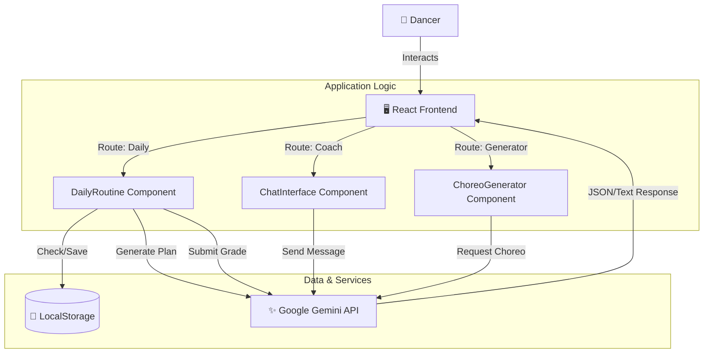
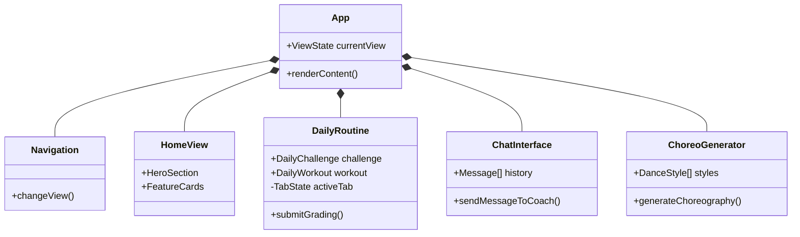
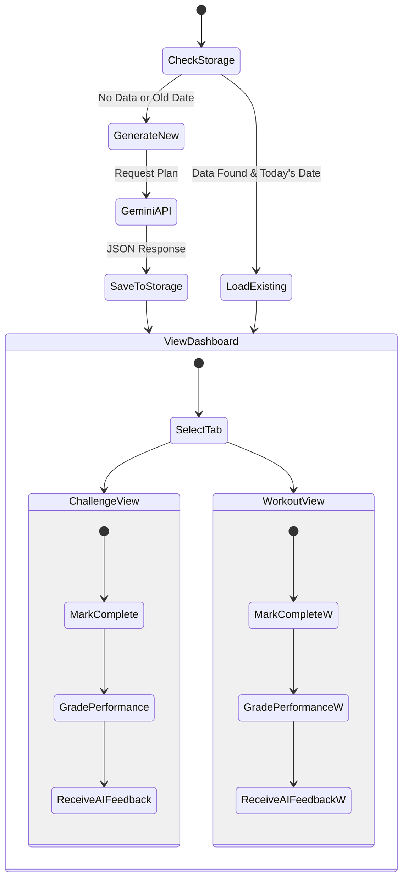

# Pulse & Plié: AI Fusion Dance Coach

**Pulse & Plié** is a cutting-edge web application that serves as a personalized AI dance coach. It specializes in **Fusion Dance**, blending the technical discipline of **Ballet**, the fluidity of **Contemporary**, the dynamics of **Jazz**, the groove of **Hip Hop**, and the flair of **K-Pop**.

It is designed to help dancers stay consistent, creative, and conditioned through AI-generated daily plans and real-time feedback.

---

## 🩰 Functionalities

<details>
<summary><strong>🤖 AI Chat Coach ("Maestro")</strong></summary>

*   **Persona**: Interactive chat with "Maestro", a fusion dance expert who balances strict ballet technique with hype street energy.
*   **Capabilities**: 
    *   Answers questions about technique, posture, and terminology.
    *   Provides emotional support and motivation.
    *   Context-aware conversations using the Gemini 2.5 Flash model.
    *   Maintains conversation history for coherent dialogue.
</details>

<details>
<summary><strong>📅 Daily Routine & Workouts</strong></summary>

*   **Dual-Track Training**: Generates a fresh plan every day consisting of:
    1.  **Creative Fusion Challenge**: A conceptual dance task mixing two random styles (e.g., Ballet + Hip Hop).
    2.  **Conditioning Workout**: A dancer-specific fitness plan including standard exercises (Sit-ups, Planks, Squats, Lunges) mixed with dance conditioning.
*   **Interactive Grading System**:
    *   Mark tasks as complete.
    *   Self-grade performance on a scale of 1-10.
    *   Write reflection notes regarding form and stamina.
    *   **AI Feedback**: Receive instant, personalized feedback from Maestro based on the self-grade and notes.
*   **Persistence**: Saves the daily plan to `LocalStorage` so refreshing the page doesn't lose the day's challenge.
</details>

<details>
<summary><strong>💃 Choreography Generator</strong></summary>

*   **Customization**: Select specific styles (Ballet, Jazz, etc.), difficulty levels (Beginner, Intermediate, Advanced), and music vibe.
*   **AI Generation**: Creates a unique 8-count routine on demand.
*   **Structured Output**: Returns a JSON-structured routine including:
    *   Counts (e.g., "1-2", "3 & 4").
    *   Action descriptions.
    *   Technical notes for execution.
    *   Style focus for specific moves.
    *   Music suggestions.
</details>

---

## 🏗️ Architecture & Diagrams

<details>
<summary><strong>Diagram 1: System Context & Data Flow</strong></summary>

This diagram illustrates how the frontend application interacts with the user, local storage, and the Google Gemini AI service.


</details>

<details>
<summary><strong>Diagram 2: Component Hierarchy</strong></summary>

Visualizing the React component structure to understand UI organization.


</details>

<details>
<summary><strong>Diagram 3: Daily Routine User Journey</strong></summary>

The flow of a user engaging with the Daily Challenge feature.


</details>

---

## 🛠️ Tech Stack

<details>
<summary><strong>Core Technologies</strong></summary>

*   **React 19**: Frontend framework.
*   **TypeScript**: Type safety and interfaces (e.g., `DailyChallenge`, `RoutineStep`).
*   **Vite**: Build tool (implied environment).
*   **Tailwind CSS**: Utility-first styling for the dark, neon aesthetic.
</details>

<details>
<summary><strong>AI Integration</strong></summary>

*   **Google GenAI SDK**: `@google/genai`
*   **Model**: `gemini-2.5-flash`
*   **Features Used**:
    *   Text Generation.
    *   Structured JSON Output (`responseSchema`).
    *   Chat Session Management (`sendMessage`).
    *   System Instructions (Persona definition).
</details>

<details>
<summary><strong>Icons & UI</strong></summary>

*   **Lucide React**: For consistent, clean iconography (e.g., `Dumbbell`, `Music`, `MessageSquare`).
*   **Google Fonts**: `Playfair Display` (Serif) for elegance, `Inter` (Sans) for readability.
</details>

---

## 🚀 Getting Started

1.  **Clone the repository.**
2.  **Install dependencies**:
    ```bash
    npm install
    ```
3.  **Set up API Key**:
    Ensure `process.env.API_KEY` is available or injected via your environment/build tool.
4.  **Run the development server**:
    ```bash
    npm run dev
    ```

---

*Built with ❤️ and AI for dancers everywhere.*